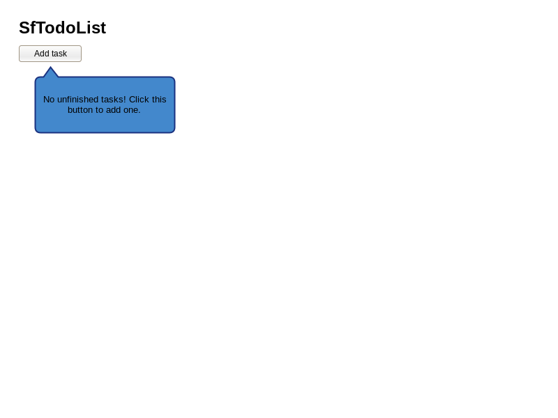
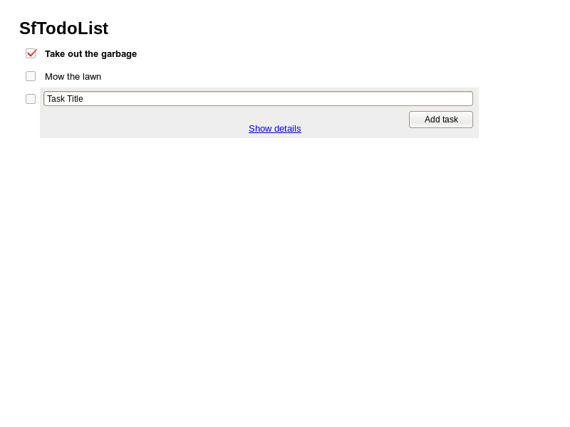
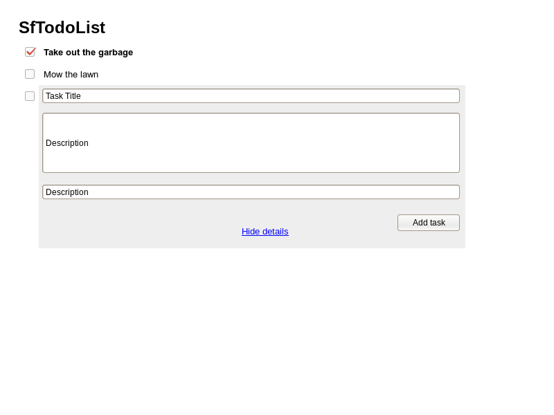

sfTODOList
==========
Functional Specification
--

Juan José Bernal Rodríguez

Last Updated: March, 20th 2016

Disclaimer
--
This specification is by no means complete, and will be updated to reflect the state of the product.

Overview
--

A TODO list consists of several **tasks** ordered in a linear manner from top to bottom.

The purpose of such a list is tracking tasks until completion.

Users of the app are able to **view** their TODO lists, **add** tasks, **modify** and **tick** them off as complete. **Deleting** and **reordering** tasks are a plus.

>### Technical note
To be able to hide tasks instead of deleting them, there is a boolean **complete** field that is set to *false* when the task has been ticked off. There is also implicit an **id** unique for each task.
In order to reorder tasks there is a numeric **position** field that holds the current order of the task in the TODO list.

Main features
--
* Add, modify, complete and reorder tasks.
* Each **task** has a *title*, a *description*, and *deadline*, being *title* the only mandatory input, and the rest optional.
* (Enhancements)
    * To better classify tasks, they can also have a *category* and *tags* associated.
    * Tracking of *created date* and *finished date*.

### Viewing tasks
Just after login, the user can see his/her TODO list. By default, only unfinished tasks are visible.
If there are no tasks in the TODO list yet, the user is invited to enter a new one.

>#### Technical note
API endpoint: /task/list
method: GET

### Adding tasks
To add a new task, the user clicks on the + button at the bottom of the list (or top if it is empty) and a text input appears on spot, letting the user type the title. Then the user can add the task by clicking the button *Add task* or hitting the *enter* key.

More advanced users can click the *Show details* button and fill the form inputs at will, then add the task by clicking *Add* or hitting the *Enter* key when the focus is in the last field.

Anyways, the **Title** field is mandatory. If the user does not input any title, a message error appears to inform the user of the problem and no task is added to the list.

>#### Technical note
API endpoint: /task/new/{title}/{description}/{...}
method: POST

### Modifying tasks
To modify a task, the user clicks on the *title* text, and editing controls analogous to adding a task appear.

>#### Technical note
API endpoint: /task/modify/{id}/{title}/{description}/{...}
method: POST

### Ticking (finishing) tasks off
The user can tick a task off just by clicking the checkbox located to the left of it. Then an animation makes the task's text get striked through and the whole box that represents the task dissapears from view.

>#### Technical note
API endpoint: /task/complete/{id}
method: POST

### Reordering tasks

>#### Technical note
API endpoint: /task/reorder/{id1}/{order1}/{id2}/{order2}
method: POST

Screen design
--
These are just quick mockups for reference.

### Empty list

### Simple form for adding a task

### Complete form for adding a task

